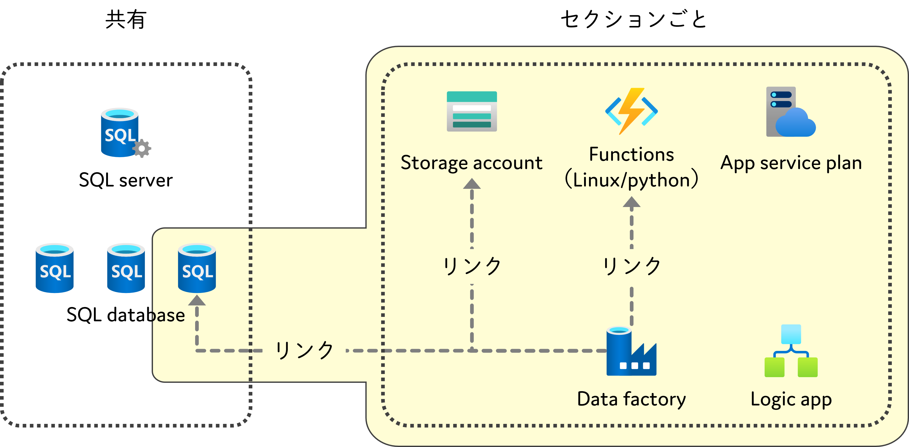

# データ収集システムを想定した Terraform サンプル

## 概要

このディレクトリ配下にある Terraform のスクリプトは、下記のリソース群を構成しています。

| ディレクトリ | 説明 |
|----|----|
| `initialization` | 共有リソースを再現するスクリプト群 |
| `deploy-section` | セクションごとのリソースを扱うスクリプト群 |



### 共有リソースを再現する `initialization`

共有リソースとして、下記のリソースを配置します。

- 共有用 resource group
  - sql server

### セクションごとのリソースを扱う `deploy-section`

セクションごとに配置されるリソースを扱います。

- セクション用 resource group
  - function app (linux/python)
  - blob storage
  - data factory
  - logic app
- 共有用 resource group (参照)
  - sql database (共有の SQL Server 配下に配置する)

## 事前準備

ソース管理用の GitHub 統合を利用します。ソースコードを管理するためのリポジトリをご用意ください。

詳細は、[ソース管理 - Azure Data Factory | Microsoft Docs](https://docs.microsoft.com/ja-jp/azure/data-factory/source-control) をご参考ください。

## 展開手順

- Azure CLI でログインする
- 共有リソースを展開する
- セクション単位のリソースを展開する
- リソースを削除する

### Azure CLI でログインする

まず、Azure CLI で利用する Azure アカウントにログインしましょう。

```bash
# Azure CLI のバージョンを確認する
az version

# アクティブになっているサブスクリプションを確認する
az account show
```

もしログインされていない場合は、下記を参考にログインしてください。

```bash
# 利用する Azure にログインする
az login

# アクティブになっているサブスクリプションを確認する
az account show
```

もし、アクティブなサブスクリプションが異なる場合は、下記を参考に設定してください。

```bash
# ログインしたアカウントが利用可能なサブスクリプション一覧を表示する
az account list

# アクティブにするサブスクリプションIDを指定する
az account -s <subscription id>
```

### 共有リソースを展開する

次に、Terraform CLI を利用してリソースを展開していきます。

```bash
cd terraform/initialization
terraform init
touch .auto.tfvars  # 入力する引数を指定するファイルを作成する
```
```powershell
cd terraform/initialization
terraform init
New-Item -Type File .auto.tfvars  # 入力する引数を指定するファイルを作成する
```

ここで、_.auto.tfvars_ を下記のように編集します。`< >` に囲まれた文字列を適宜変更してください。

```tf
shared_resource_group_name = "<共有リソース用のリソースグループ名>"
shared_mssql_server_name = "<共有用のMSSQLサーバーの名前>"
shared_mssql_server_administrator_login_name = "<共有用MSSQLサーバーのログインユーザー名>"
shared_mssql_server_administrator_login_password = "<共有用MSSQLサーバーのログインパスワード>"
```

編集した _.auto.tfvars_ をもとに、Terraform でリソースの差分を確認しましょう。

```bash
terraform plan
```

差分を確認して問題がなければ、リソースを適用しましょう。

```bash
terraform apply
```

最後に、出力させていた `shared_mssql_server_administrator_login_password` の値を環境変数に保持しておきましょう。

```bash
MSSQL_PASSWORD=`terraform output -json | jq -r .shared_mssql_server_administrator_login_password.value`
```
```powershell
$MSSQL_PASSWORD=(terraform output -json | ConvertFrom-Json).shared_mssql_server_administrator_login_password.value
```

### セクション単位のリソースを展開する

それではつぎに、セクションごとのリソースを展開してみましょう。

```bash
cd ../deploy-section
terraform init
```

こちらでも、渡す引数を編集します。

```bash
touch .auto.tfvars  # 入力する引数を指定するファイルを作成する
```
```powershell
New-Item -Type File .auto.tfvars  # 入力する引数を指定するファイルを作成する
```

```tf
shared_resource_group_name = "<共有リソース用のリソースグループ名>"
shared_mssql_server_name = "<共有用のMSSQLサーバーの名前>"
sections = [
  {
    name       = "<セクション識別用の文字列>"
    resource_identifier = "<リソースに対するセクション識別用の文字列>"
    github_configuration = {
      account_name    = "<GitHub のアカウント名、または Organization 名>"
      branch_name     = "<コラボレーション ブランチの名前>"
      git_url         = "<リポジトリのURL>"
      repository_name = "<リポジトリ名>"
      root_folder     = "<ルート フォルダー>"
    }
  }
]
```

_.auto.tfvars_ が準備できたら、Terraform で差分確認、適用していきましょう。このように、 `-var` というプロパティでも引数を渡せます。

```bash
terraform plan -var shared_mssql_server_administrator_login_password=$MSSQL_PASSWORD
terraform apply -var shared_mssql_server_administrator_login_password=$MSSQL_PASSWORD
```

### リソースを削除する

リソースが不要になったら、 `terraform deploy` で削除しておきましょう。

```bash
cd terraform/deploy-section
terraform destroy -var shared_mssql_server_administrator_login_password=$MSSQL_PASSWORD
```

```bash
cd terraform/initialization
terraform destroy
```